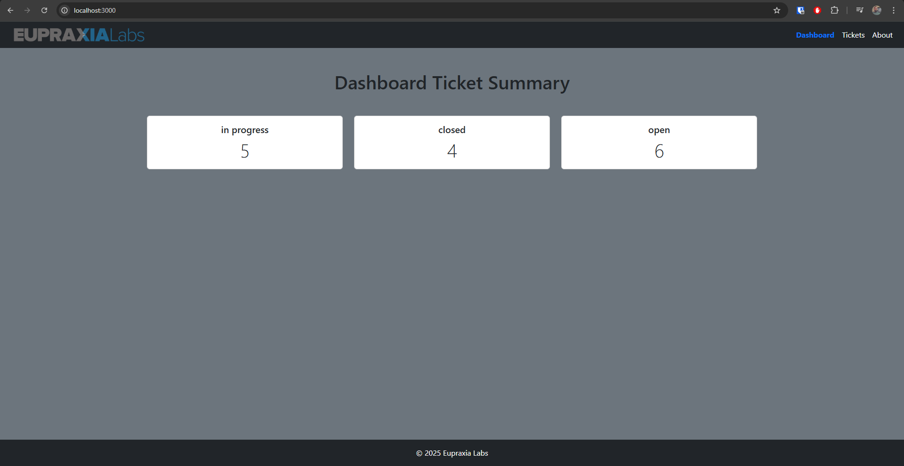
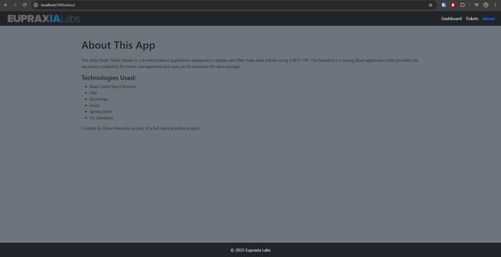
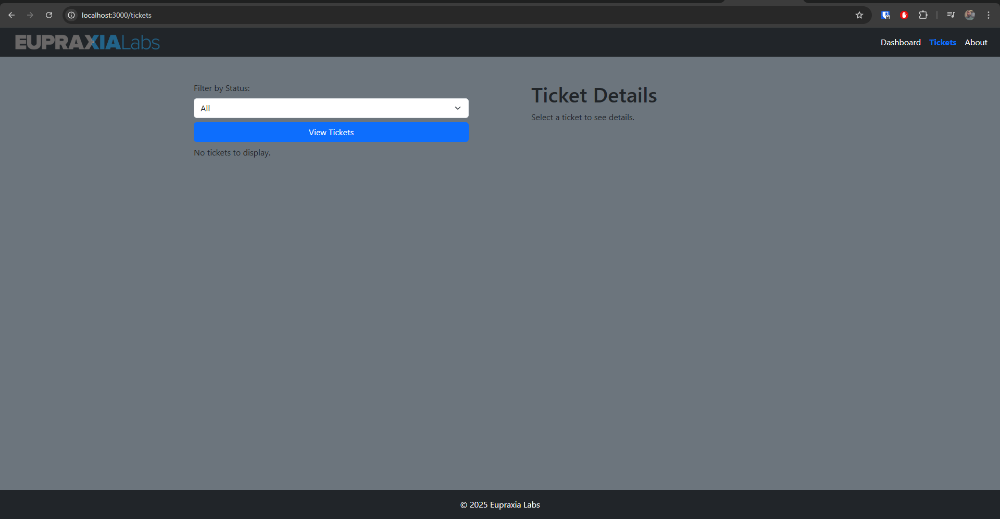
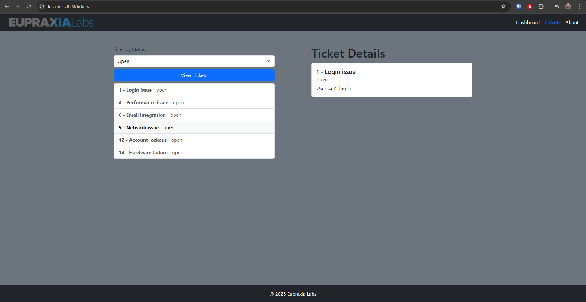

# Help Desk Ticket Viewer

A full-stack web application built with a **React (Vite)** frontend and a **Spring Boot** backend  with an  
Embedded H2 database.

---

## Features

- View help desk tickets by status (Open, In Progress, Closed)
- Click to view individual ticket details
- Dashboard summary of ticket counts

---

## Prerequisites

Make sure you have the following installed:

- Node.js (v20 or later)
- npm (comes with Node)
- Java JDK 17
- Maven (optional — included wrapper `mvnw` can be used)
- Podman (optional) - for container deployment

---

## Setup & Run Instructions

### 1. Clone the Repository

git clone https://github.com/CodeDTX11/helpdesk-ticket-viewer.git
cd helpdesk-ticket-viewer

cd helpdesk-api

### For non-container run:

./mvnw spring-boot:run   # Mac/Linux

.\mvnw.cmd spring-boot:run # Windows

### For frontend:

cd ..

cd helpdesk-ui
npm install
npm run dev

- Vite will provide a link to jump to the UI.

http://localhost:3000/

### ..or for container:

cd helpdesk

./mvnw clean package

podman build -t backend .
podman run -p 8080:8080 backend

## untested
cd ..

cd helpdesk-ui

podman build -t frontend .
podman run -p 3000:3000 frontend

## Helpful Tools
### While the backend is running, utilize the following tools:
- Use http://localhost:8080/swagger-ui/index.html and http://localhost:8080/v3/api-docs for OpenAPI Documentation
- Use http://localhost:8080/h2-console for H2 database console UI
  - username = "sa" password = ""

## Screenshots

